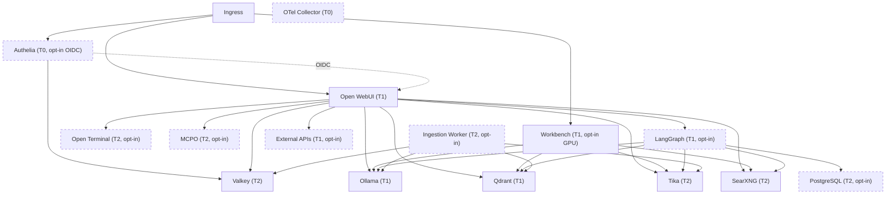

# ai-stack

[](https://github.com/rmednitzer/ai-stack/actions/workflows/lint.yaml)
[](LICENSE)
[](Chart.yaml)
[](CODE_OF_CONDUCT.md)

Comprehensive AI inference and tooling stack for EU-regulated on-premises and hybrid platform operations, deployed as a single Helm chart.

Includes [Open WebUI](https://github.com/open-webui/open-webui), [Ollama](https://ollama.com/), [Qdrant](https://qdrant.tech/), [Apache Tika](https://tika.apache.org/), [SearXNG](https://docs.searxng.org/), [Valkey](https://valkey.io/), [Open Terminal](https://github.com/open-webui/open-terminal), [MCPO](https://github.com/open-webui/mcpo), [LangGraph](https://langchain-ai.github.io/langgraph/), [PostgreSQL](https://www.postgresql.org/) (standalone, [CloudNativePG](https://cloudnative-pg.io/), or external), [Authelia](https://www.authelia.com/) for OIDC/SSO/MFA, an async ingestion worker, and an [OpenTelemetry Collector](https://opentelemetry.io/docs/collector/) with PII redaction.

Designed for governance-as-code environments with PSA restricted baseline, NetworkPolicy default-deny, and OpenTelemetry instrumentation hooks.

## Architecture



### Component Tiers

Components are classified by operational criticality:

| Tier | Meaning | Components |
|------|---------|------------|
| T0 | Safety / Integrity — non-negotiable for security and compliance | OTel Collector, Authelia |
| T1 | Operational — core inference and decision-making services | Open WebUI, Ollama, Qdrant, Workbench, LangGraph |
| T2 | Productivity — supporting services and optional tooling | Tika, SearXNG, Valkey, Open Terminal, MCPO, PostgreSQL, Ingestion Worker |

### Default Images

Image versions are defined in [`values.yaml`](values.yaml) per component. For a full software bill of materials including licenses and dependency graph, see [`sbom.cdx.json`](sbom.cdx.json).

## Prerequisites

- Kubernetes 1.27+
- Helm 3.12+
- A StorageClass for PersistentVolumeClaims (or use `emptyDir` for lab)
- (Optional) NVIDIA GPU Operator for Ollama / Workbench GPU acceleration
- (Optional) Prometheus Operator CRDs for ServiceMonitor resources
- (Optional) cert-manager for automated TLS certificate provisioning
- (Optional) CloudNativePG operator v1.25+ for HA PostgreSQL (`postgres.mode: cnpg`)

## Quick Start

```bash
# Install with lab defaults
helm install ai-stack . -n ai-stack --create-namespace

# Lab with GPU enabled for Ollama
helm install ai-stack . -n ai-stack --create-namespace \
  --set ollama.gpu.enabled=true

# Production overlay
helm install ai-stack . -n ai-stack --create-namespace \
  -f values.yaml -f values-prod.yaml
```

Pull your first models:

```bash
kubectl exec -n ai-stack deploy/ai-stack-ollama -- ollama pull llama3.2
kubectl exec -n ai-stack deploy/ai-stack-ollama -- ollama pull nomic-embed-text
```

Access Open WebUI:

```bash
kubectl port-forward -n ai-stack svc/ai-stack-openwebui 8080:8080
# Open http://localhost:8080
```

## Configuration

The chart ships two value files:

| File | Purpose |
|------|---------|
| `values.yaml` | Full reference with all defaults (lab profile) |
| `values-prod.yaml` | Production overlay — HA, TLS ingress, GPU, stricter resources, OTel |

### Global Settings

| Parameter | Description | Default |
|-----------|-------------|---------|
| `global.profile` | Deployment profile (`lab` or `prod`) | `lab` |
| `global.namespace` | Target namespace | `ai-stack` |
| `global.imagePullPolicy` | Image pull policy | `IfNotPresent` |
| `global.storageClass` | Storage class for all PVCs | `""` (cluster default) |
| `global.podSecurityStandard` | PSA enforcement level | `restricted` |
| `global.networkPolicy.enabled` | Deploy default-deny NetworkPolicies | `true` |
| `global.otel.enabled` | Deploy OTel Collector and inject env vars | `false` |
| `global.otel.endpoint` | OTLP endpoint | `http://otel-collector....:4317` |
| `global.serviceMonitor.enabled` | Create Prometheus ServiceMonitor CRDs | `false` |

### Component Toggles

Every component can be individually enabled or disabled:

```yaml
openwebui:
  enabled: true     # Primary UI (default: true)
ollama:
  enabled: true     # LLM inference (default: true)
qdrant:
  enabled: true     # Vector DB for RAG (default: true)
tika:
  enabled: true     # Document extraction (default: true)
searxng:
  enabled: true     # Web search (default: true)
valkey:
  enabled: true     # Session cache (default: true)
workbench:
  enabled: false    # GPU ML workbench (opt-in)
openTerminal:
  enabled: false    # Sandboxed terminal for AI agents (opt-in)
mcpo:
  enabled: false    # MCP-to-OpenAPI proxy (opt-in)
langgraph:
  enabled: false    # LangGraph agentic runtime (opt-in)
postgres:
  enabled: false    # PostgreSQL for LangGraph checkpoints (opt-in)
ingestionWorker:
  enabled: false    # Async document ingestion worker (opt-in)
authelia:
  enabled: false    # OIDC identity provider for SSO/MFA (opt-in)
```

### Secrets

The chart auto-generates secrets on first install for:

- **Qdrant API key** (`qdrant-secret`)
- **SearXNG secret key** (`searxng-secret`)
- **Workbench token** (`workbench-secret`)
- **Open Terminal API key** (`open-terminal-secret`)
- **MCPO API key** (`mcpo-secret`)
- **LangGraph API key** (`langgraph-secret`)
- **PostgreSQL password** (`postgres-secret`)
- **Authelia secrets** (`authelia-secret`) — JWT secret, session secret, storage encryption key, OIDC client secret

Secrets are annotated with `helm.sh/resource-policy: keep` so they survive `helm upgrade`. To use an external secret manager (e.g., ESO or Vault), set the corresponding value:

```yaml
qdrant:
  apiKey: "your-external-key"
searxng:
  secretKey: "your-external-key"
openTerminal:
  apiKey: "your-external-key"
mcpo:
  apiKey: "your-external-key"
langgraph:
  apiKey: "your-external-key"
postgres:
  password: "your-external-password"
```

### GPU Support

```yaml
ollama:
  gpu:
    enabled: true
    count: 1
    resourceName: nvidia.com/gpu

workbench:
  enabled: true
  gpu:
    enabled: true
    count: 1
    resourceName: nvidia.com/gpu
```

### Ingress

```yaml
openwebui:
  ingress:
    enabled: true
    className: "envoy"
    hosts:
      - host: ai.example.com
        paths:
          - path: /
            pathType: Prefix
    tls:
      - secretName: ai-tls
        hosts:
          - ai.example.com
```

### External Inference APIs

Add cloud-hosted LLM providers (OpenAI, Azure OpenAI, Anthropic, Gemini, Mistral, etc.) alongside local Ollama inference:

```yaml
externalAPIs:
  enabled: true
  providers:
    - name: openai
      baseUrl: "https://api.openai.com/v1"
      apiKey: "sk-..."
    - name: gemini
      baseUrl: "https://generativelanguage.googleapis.com/v1beta/openai"
      apiKey: "AIza..."
```

API keys are stored in Kubernetes Secrets. For production, use an external secret manager:

```yaml
externalAPIs:
  enabled: true
  providers:
    - name: openai
      baseUrl: "https://api.openai.com/v1"
      existingSecret:
        name: "my-openai-secret"
        key: "api-key"
```

When enabled, Open WebUI users can select external models from the model picker alongside locally-served Ollama models. HTTPS egress (port 443) is automatically added to the Open WebUI NetworkPolicy.

### LangGraph (Agentic Workloads)

Enable stateful agentic workflows with LangGraph Platform. Requires PostgreSQL for checkpoint persistence:

```yaml
langgraph:
  enabled: true
postgres:
  enabled: true
```

LangGraph connects to Ollama for LLM inference, Qdrant for vector retrieval, Tika for document extraction, and SearXNG for web search. Deploy custom graphs by either:

1. **Custom image** (recommended): Build with `langgraph build -t my-graphs` and override `langgraph.image.repository`/`tag`
2. **Volume mount**: Place graph code in the `/deps/graphs` persistent volume

### PostgreSQL Modes

The chart supports three PostgreSQL provisioning modes:

| Mode | Use case | HA | Managed by |
|------|----------|----|------------|
| `standalone` | Lab / dev — single-instance Deployment | No | Helm chart |
| `cnpg` | Production — CloudNativePG operator cluster | Yes (3 instances, streaming replication, automated failover) | CNPG operator |
| `external` | Bring-your-own managed PostgreSQL (RDS, Cloud SQL, etc.) | Depends on provider | External |

```yaml
# Production HA with CloudNativePG
postgres:
  enabled: true
  mode: cnpg
  tls:
    mode: require
  cnpg:
    instances: 3
    pooler:
      enabled: true  # PgBouncer connection pooling

# External managed database
postgres:
  enabled: true
  mode: external
  database: "langgraph"
  user: "langgraph"
  external:
    host: "my-rds-instance.abc123.us-east-1.rds.amazonaws.com"
    port: 5432
    existingSecret:
      name: "rds-password"
      key: "password"
```

### Async Document Ingestion

The ingestion worker consumes tasks from a Valkey Stream and orchestrates: Tika extract, chunk, Ollama embed, Qdrant upsert. Enables non-blocking document uploads with automatic retry and status tracking.

```yaml
ingestionWorker:
  enabled: true
valkey:
  persistence:
    enabled: true  # Recommended: persist Valkey Streams across restarts
```

Producers enqueue tasks via `XADD`:

```
XADD ingestion:documents * task_id <id> file_url <url> filename <name>
```

Track status via `HGETALL ingestion:status:<task_id>`.

### Authelia (SSO / OIDC)

Enable Authelia as an OpenID Connect identity provider for Open WebUI. When enabled, Open WebUI is automatically configured as an OIDC client (`OAUTH_*` environment variables are injected). Authelia uses Valkey for session storage (when available) and supports SQLite (lab) or PostgreSQL (prod) as its storage backend.

```yaml
authelia:
  enabled: true
  domain: "example.local"
  defaultPolicy: "one_factor"  # or "two_factor" for MFA
  oidc:
    clientId: "openwebui"
    issuerUrl: "https://auth.example.local"
  ingress:
    enabled: true
    className: "envoy"
    hosts:
      - host: auth.example.local
        paths:
          - path: /
            pathType: Prefix
    tls:
      - secretName: auth-tls
        hosts:
          - auth.example.local
```

For production with PostgreSQL storage:

```yaml
authelia:
  enabled: true
  storage: "postgres"  # Uses the shared postgres component
postgres:
  enabled: true
```

Users are managed via a file-based backend (`users_database.yml`). Override by mounting a custom ConfigMap or configure LDAP. Generate password hashes with `authelia crypto hash generate argon2`.

### OpenTelemetry

When `global.otel.enabled=true`, the chart:

1. Deploys an OTel Collector with OTLP receivers, GenAI semantic conventions, and PII redaction
2. Injects `OTEL_*` environment variables into all component pods
3. Optionally creates ServiceMonitor resources for Prometheus scraping

### Disaster Recovery

For production DR, use [Velero](https://velero.io/) with CSI volume snapshots for PVC-backed data (Qdrant, Ollama models, Open WebUI). PostgreSQL in CNPG mode supports automated backups via Barman to S3-compatible storage — see [HOWTO.md](HOWTO.md) §10 for configuration.

## Security

This chart is designed for regulated environments:

- **Network isolation**: Default-deny ingress and egress with per-component allowlists
- **Pod Security**: PSA restricted baseline — `runAsNonRoot`, `seccompProfile: RuntimeDefault`, `allowPrivilegeEscalation: false`, capabilities `drop: [ALL]`
- **Read-only root filesystem**: Enforced for Qdrant, Valkey, Tika, SearXNG, OTel Collector
- **Identity isolation**: Per-component ServiceAccounts with `automountServiceAccountToken: false`
- **Secret management**: Auto-generated 64-byte credentials with support for external secret stores
- **PII redaction**: OTel Collector strips email addresses, SSNs, and credit card numbers from telemetry (GDPR Art 5(1)(c))
- **Telemetry opt-out**: `DO_NOT_TRACK`, `SCARF_NO_ANALYTICS`, `ANONYMIZED_TELEMETRY=false` set by default
- **Rate limiting**: Envoy Gateway rate-limit annotations in production profile
- **Ollama root exception**: Upstream GPU access requirement; documented with `assurance.platform/security-exception` annotation

## Governance and Compliance

Control and policy identifiers used in this chart are defined in
[docs/governance/CONTROLS.md](docs/governance/CONTROLS.md).

| Control | Description | Implementation |
|---------|-------------|----------------|
| CTL-001 | Observability | OTel Collector, ServiceMonitors |
| CTL-002 | AI gateway policy | NetworkPolicy, tier labels, boundary annotations |
| POL-001 | Least-privilege | Per-component ServiceAccounts, no automount |
| GDPR Art 5(1)(c) | Data minimisation | PII redaction in OTel pipeline |
| NIS2 | Network security | Default-deny NetworkPolicies |
| AI Act | Risk classification | Tier and boundary labeling |

All pods carry `assurance.platform/*` annotations for evidence pipeline integration and audit traceability.

## SBOM and License Compliance

The chart includes a machine-readable Software Bill of Materials and license compliance documentation:

| File | Format | Purpose |
|------|--------|---------|
| [sbom.cdx.json](sbom.cdx.json) | CycloneDX 1.6 JSON | Machine-readable SBOM with all container images, licenses, purls, and dependency graph |
| [LICENSE_COMPLIANCE.md](docs/compliance/LICENSE_COMPLIANCE.md) | Markdown | Human-readable license matrix, copyleft analysis, and enterprise compliance checklist |

All default-enabled components use permissive licenses (MIT, Apache-2.0, BSD-3-Clause). Notable exceptions:

- **SearXNG** (AGPL-3.0): Low risk when using the upstream container unmodified. See compliance doc for details.
- **LangGraph API** (Elastic License 2.0): Opt-in only. Permits self-hosted use but prohibits offering as a managed service.

The SBOM is validated in CI against the CycloneDX 1.6 schema and cross-checked against `values.yaml` to ensure completeness. Deep per-image SBOMs are generated via Syft and uploaded as CI artifacts.

## CI Pipeline

The GitHub Actions workflow (`lint.yaml`) runs on every PR and push to `main`:

| Job | What it does |
|-----|--------------|
| **helm-lint** | `helm lint` and `helm template` for both lab and prod profiles |
| **chart-testing** | `ct lint` with chart-testing for standards compliance |
| **sbom-validate** | Validates `sbom.cdx.json` against CycloneDX 1.6 schema; cross-checks component count against `values.yaml` |
| **syft-sbom** | Generates deep per-image SBOMs via Syft, validates them, and uploads as artifacts |
| **cve-scan** | Scans all container images for CVEs using Grype; emits warnings on critical vulnerabilities |
| **kubeconform** | Validates rendered manifests against Kubernetes JSON schemas (lab + prod profiles) |

## GitOps / ArgoCD

Pre-built ArgoCD Application manifests are provided in `argocd/`:

| File | Profile | Notes |
|------|---------|-------|
| `argocd/application-lab.yaml` | Lab | Auto-sync disabled — suitable for development |
| `argocd/application-prod.yaml` | Production | Manual sync — change-control compliance |

## Dependency Management

GitHub Actions versions are managed by [Dependabot](https://docs.github.com/en/code-security/dependabot). Container image versions in `values.yaml` are managed manually. Configuration is in `.github/dependabot.yml`.

## Verification

After installation, verify the deployment:

```bash
# Check all pods are running
kubectl get pods -n ai-stack

# Verify NetworkPolicies are applied
kubectl get networkpolicies -n ai-stack

# Check secrets were generated
kubectl get secrets -n ai-stack

# Verify ServiceAccounts
kubectl get serviceaccounts -n ai-stack

# Check PodDisruptionBudgets
kubectl get pdb -n ai-stack

# Run Helm tests
helm test ai-stack -n ai-stack
```

## Development

```bash
# Lint the chart
helm lint .

# Lint with production values
helm lint . -f values.yaml -f values-prod.yaml

# Template rendering check
helm template ai-stack . --debug

# Dry-run install
helm install ai-stack . --dry-run --debug -n ai-stack

# Chart-testing
ct lint --config ct.yaml --charts .
```

See [HOWTO.md](HOWTO.md) for a comprehensive task-oriented guide covering installation, day-1 setup, RAG configuration, GPU acceleration, scaling, EU compliance, and troubleshooting.

See [CONTRIBUTING.md](CONTRIBUTING.md) for guidelines on pull requests, security contexts, and governance labels.

See [CHANGELOG.md](CHANGELOG.md) for a detailed list of changes in each release.

## EU Compliance

The chart ships with templates and guidance for EU-regulated deployments:

| Document | Purpose |
|----------|---------|
| [docs/governance/CONTROLS.md](docs/governance/CONTROLS.md) | Authoritative registry of all CTL and POL identifiers with descriptions and regulatory basis |
| [EU_COMPLIANCE_CHECK.md](docs/compliance/EU_COMPLIANCE_CHECK.md) | Gap analysis against GDPR, AI Act, NIS2, CRA, ePrivacy |
| [SECURITY.md](SECURITY.md) | Coordinated vulnerability disclosure (CVD) policy |
| [docs/compliance/DPIA_TEMPLATE.md](docs/compliance/DPIA_TEMPLATE.md) | Data Protection Impact Assessment template (GDPR Art. 35 + AI Act Art. 27) |
| [docs/compliance/ROPA_TEMPLATE.md](docs/compliance/ROPA_TEMPLATE.md) | Records of Processing Activities template (GDPR Art. 30) |
| [docs/compliance/INCIDENT_RESPONSE.md](docs/compliance/INCIDENT_RESPONSE.md) | Incident response playbook (GDPR Art. 33/34, NIS2 Art. 23, AI Act Art. 73) |
| [docs/compliance/DSAR_PROCEDURES.md](docs/compliance/DSAR_PROCEDURES.md) | Data subject rights procedures (GDPR Art. 15–22) |
| [docs/compliance/EU_OPERATIONS_GUIDE.md](docs/compliance/EU_OPERATIONS_GUIDE.md) | Data retention, DPA guidance, encryption, content marking, training |

AI Act Art. 50(1) transparency is implemented via a configurable `WEBUI_BANNER_TEXT` environment variable that informs users they are interacting with an AI system.

## License

This project is licensed under the Apache License 2.0. See [LICENSE](LICENSE) for details.

## Maintainers

| Name | Email |
|------|-------|
| Roman Mednitzer | r.mednitzer@outlook.com |
