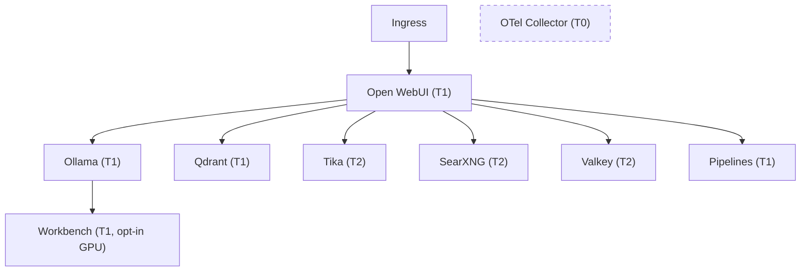

# ai-stack

Comprehensive AI inference and tooling stack for EU-regulated on-premises and hybrid platform operations.

Deploys [Open WebUI](https://github.com/open-webui/open-webui), [Ollama](https://ollama.com/), [Qdrant](https://qdrant.tech/), [Apache Tika](https://tika.apache.org/), [SearXNG](https://docs.searxng.org/), [Jupyter](https://jupyter.org/), [Valkey](https://valkey.io/), [Open WebUI Pipelines](https://github.com/open-webui/pipelines), and supporting infrastructure as a single Helm chart.

Designed for governance-as-code environments with PSA restricted baseline, NetworkPolicy default-deny, and OpenTelemetry instrumentation hooks.

## Architecture



Tiering follows the platform-assurance stack-bom classification:

| Tier | Meaning | Components |
|------|---------|------------|
| T0 | Safety / Integrity | OTel Collector |
| T1 | Operational | Open WebUI, Ollama, Qdrant, Pipelines, Workbench |
| T2 | Productivity | Tika, SearXNG, Jupyter, Valkey |

## Prerequisites

- Kubernetes 1.27+
- Helm 3.12+
- A storage class for PersistentVolumeClaims (or use `emptyDir` for lab)
- (Optional) NVIDIA GPU Operator for Ollama / Workbench GPU acceleration
- (Optional) Prometheus Operator CRDs for ServiceMonitor resources
- (Optional) cert-manager for automated TLS certificate provisioning

## Quick Start

```bash
# Add and install (from local checkout)
helm install ai-stack . -n ai-stack --create-namespace

# Lab profile (default) with GPU enabled for Ollama
helm install ai-stack . -n ai-stack --create-namespace \
  --set ollama.gpu.enabled=true

# Production overlay
helm install ai-stack . -n ai-stack --create-namespace \
  -f values.yaml -f values-prod.yaml
```

After installation, pull your first model:

```bash
kubectl exec -n ai-stack deploy/ai-stack-ollama -- ollama pull llama3.2
kubectl exec -n ai-stack deploy/ai-stack-ollama -- ollama pull nomic-embed-text
```

Access Open WebUI:

```bash
kubectl port-forward -n ai-stack svc/ai-stack-openwebui 8080:8080
# Open http://localhost:8080
```

## Configuration

The chart ships two value files:

| File | Purpose |
|------|---------|
| `values.yaml` | Full reference with all defaults (lab profile) |
| `values-prod.yaml` | Production overlay with HA, TLS ingress, GPU, and stricter resources |

### Global Settings

| Parameter | Description | Default |
|-----------|-------------|---------|
| `global.profile` | Deployment profile (`lab` or `prod`) | `lab` |
| `global.namespace` | Target namespace | `ai-stack` |
| `global.imagePullPolicy` | Image pull policy | `IfNotPresent` |
| `global.storageClass` | Storage class for all PVCs | `""` (cluster default) |
| `global.podSecurityStandard` | PSA enforcement level | `restricted` |
| `global.networkPolicy.enabled` | Deploy default-deny NetworkPolicies | `true` |
| `global.otel.enabled` | Deploy OTel Collector and inject env vars | `false` |
| `global.otel.endpoint` | OTLP endpoint | `http://otel-collector....:4317` |
| `global.serviceMonitor.enabled` | Create Prometheus ServiceMonitor CRDs | `false` |

### Component Toggles

Every component can be individually enabled or disabled:

```yaml
openwebui:
  enabled: true     # Primary UI (default: true)
ollama:
  enabled: true     # LLM inference (default: true)
qdrant:
  enabled: true     # Vector DB for RAG (default: true)
tika:
  enabled: true     # Document extraction (default: true)
searxng:
  enabled: true     # Web search (default: true)
jupyter:
  enabled: true     # Notebook environment (default: true)
workbench:
  enabled: false    # GPU ML workbench (default: false, opt-in)
pipelines:
  enabled: true     # Function pipelines (default: true)
valkey:
  enabled: true     # Valkey session cache (default: true)
```

### Secrets

The chart auto-generates secrets on first install for:

- **Qdrant API key** (`qdrant-secret`)
- **SearXNG secret key** (`searxng-secret`)
- **Jupyter token** (`jupyter-secret`)
- **Workbench token** (`workbench-secret`)

Secrets are annotated with `helm.sh/resource-policy: keep` so they survive `helm upgrade`. To use an external secret manager (e.g., ESO or Vault), set the corresponding value:

```yaml
qdrant:
  apiKey: "your-external-key"
searxng:
  secretKey: "your-external-key"
jupyter:
  token: "your-external-token"
```

### GPU Support

```yaml
ollama:
  gpu:
    enabled: true
    count: 1
    resourceName: nvidia.com/gpu

workbench:
  enabled: true
  gpu:
    enabled: true
    count: 1
    resourceName: nvidia.com/gpu
```

### Ingress

```yaml
openwebui:
  ingress:
    enabled: true
    className: "nginx"
    hosts:
      - host: ai.example.com
        paths:
          - path: /
            pathType: Prefix
    tls:
      - secretName: ai-tls
        hosts:
          - ai.example.com
```

### OpenTelemetry

When `global.otel.enabled=true`, the chart:

1. Deploys an OTel Collector with OTLP receivers, GenAI semantic conventions, and PII redaction
2. Injects `OTEL_*` environment variables into all component pods
3. Optionally creates ServiceMonitor resources for Prometheus scraping

## Security

This chart is designed for regulated environments:

- **Network isolation**: Default-deny ingress and egress with per-component allowlists
- **Pod Security**: PSA restricted baseline, `seccompProfile: RuntimeDefault`, `allowPrivilegeEscalation: false`, capabilities `drop: [ALL]`
- **Identity isolation**: Per-component ServiceAccounts with `automountServiceAccountToken: false`
- **Secret management**: Auto-generated credentials with support for external secret stores
- **PII redaction**: OTel Collector strips email addresses, SSNs, and credit card numbers from telemetry (GDPR Art 5(1)(c))
- **Telemetry opt-out**: `DO_NOT_TRACK`, `SCARF_NO_ANALYTICS`, `ANONYMIZED_TELEMETRY=false` set by default

## Governance and Compliance

The chart aligns with the platform-assurance governance framework:

| Control | Description | Implementation |
|---------|-------------|----------------|
| CTL-0006 | Observability | OTel Collector, ServiceMonitors |
| CTL-0009 | AI gateway policy | NetworkPolicy, tier labels, boundary annotations |
| POL-03 | Least-privilege | Per-component ServiceAccounts, no automount |
| GDPR Art 5(1)(c) | Data minimisation | PII redaction in OTel pipeline |
| NIS2 | Network security | Default-deny NetworkPolicies |
| AI Act | Risk classification | Tier and boundary labeling |

## Verification

After installation, verify the deployment:

```bash
# Check all pods are running
kubectl get pods -n ai-stack

# Verify NetworkPolicies are applied
kubectl get networkpolicies -n ai-stack

# Check secrets were generated
kubectl get secrets -n ai-stack

# Verify ServiceAccounts
kubectl get serviceaccounts -n ai-stack

# Check PodDisruptionBudgets
kubectl get pdb -n ai-stack
```

## Development

### Linting

```bash
# Lint the chart
helm lint .

# Lint with production values
helm lint . -f values.yaml -f values-prod.yaml

# Template rendering check
helm template ai-stack . --debug
```

### Testing

```bash
# Dry-run install
helm install ai-stack . --dry-run --debug -n ai-stack

# Use chart-testing (ct)
ct lint --charts .
```

## License

This project is licensed under the Apache License 2.0. See [LICENSE](LICENSE) for details.

## Maintainers

| Name | Email |
|------|-------|
| Roman Mednitzer | r.mednitzer@outlook.com |
